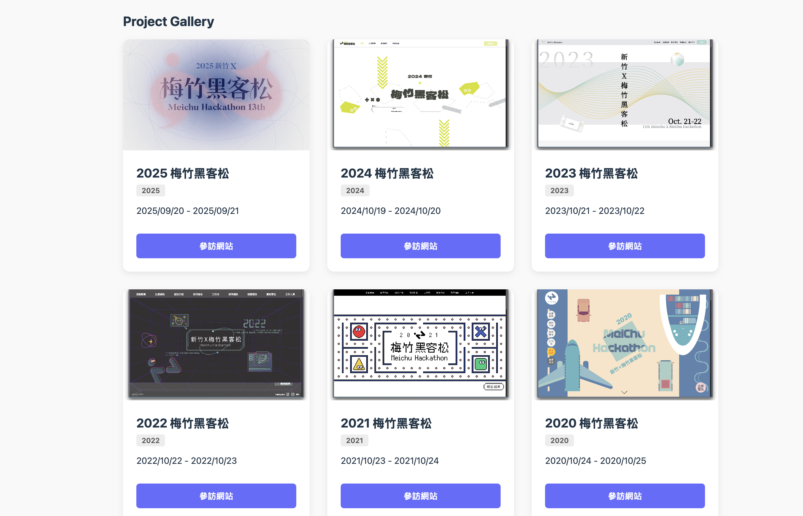
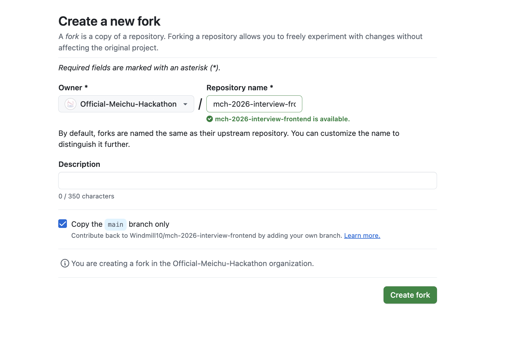

# MCH 2026 Interview Project

---

### 第一部分：自我介紹

#### 要求
來介紹一下你自己吧！這個任務要求你完成一個簡單且美化過的自我介紹區塊。


- **內容填寫**：請大家自由發揮，格式不限，但請包含列點的資訊
- **排版**：大家可以多多美化，但請注意RWD，確保電腦版放大縮小不會跑版

#### 提示
- 只需要動到 `src/components/SelfIntro.jsx` 和 `src/styles/SelfIntro.css` 兩個檔案

---

### 第二部分：歷年梅竹黑客松網站

#### 要求
這部分請從提供的API端點取得歷屆黑客松網站的資料，並呈現在頁面上。



- **排版**：大家可以多多美化，但請注意RWD，但同樣要確保電腦版放大縮小不會跑版

#### 提示
- 只需要動到 `src/components/WebsiteList.jsx` 和 `src/styles/WebsiteList.css` 兩個檔案
- 請注意API端點：`VITE_API_URL=https://mch-2026-interview-backend.vercel.app/api/websites`
- 請注意API回傳的資料格式：`{ pagination: {...}, data: [...] }`
- 可以參考 API 文件與程式碼中的TODO註解

---

#### 如何開始

> **前置要求**：請確保電腦已安裝 Node.js (建議 v18 以上版本)。

1. **點擊右上角Fork將此專案Fork到自己的Repo中**  
   <br>
   
   <br><br>

2. **Clone 專案**
   ```bash
   git clone https://github.com/<username>/mch-2026-interview-frontend.git
   ```

3. **開啟terminal 執行**
   ```bash
   npm install
   npm run dev
   ```

4. **開啟瀏覽器在localhost 完成工作**

5. **完成後**
   ```bash
   git add .
   git commit -m "完成工作"
   git push
   ```

6. **接著我們要部署寫好的網頁，首先執行**
   ```bash
   npm run build
   npm run deploy
   ```
   接著點開網頁Github 在右側的 About
   <br>
   
   <br><br>

7. **勾選 "Use your GitHub Pages Website" 儲存後點開即可看到自己的網頁**  
   <br>
   
   <br><br>

8. **最後在頂部選擇Pull requests 並發送一份PR給我們即可**

---

#### 注意事項
- 請不要攻擊我們的API端點，我們有流量監控，把它打下來並不會加分...
- 我們沒有限制使用LLM，但盡可能以LLM為輔，自己還是要實作並理解code，我們會在面試的時候問相關問題喔！
- 如果有問題歡迎詢問
